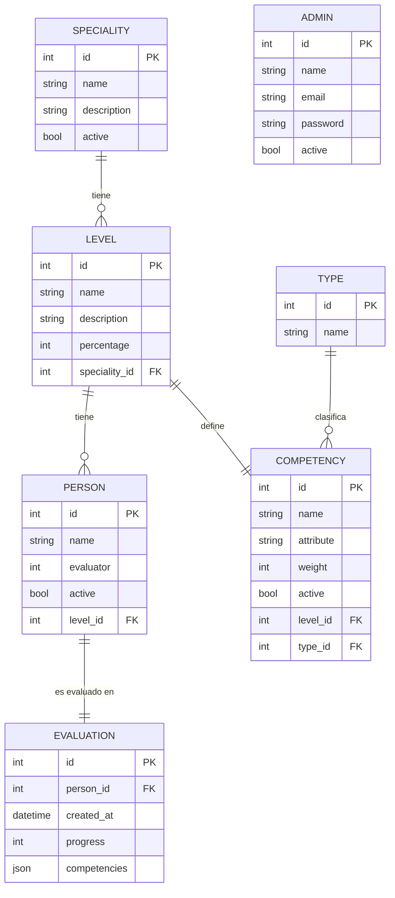

# Demo Dashboard

Panel de administración full-stack para la gestión de especialidades, niveles, competencias, personas y evaluaciones.

---

## Tecnologías

### Backend
| Capa | Tecnología |
|------|-----------|
| Lenguaje | PHP 8.1+ |
| Framework | Symfony 6.4 |
| ORM | Doctrine ORM 3 |
| Base de datos | PostgreSQL |
| Autenticación | JWT (`lexik/jwt-authentication-bundle`) |
| CORS | `nelmio/cors-bundle` |

### Frontend
| Capa | Tecnología |
|------|-----------|
| Lenguaje | TypeScript |
| Framework | Angular 21 |
| Estilos | SCSS + Bootstrap 5 |
| Iconos | Angular Material Icons |
| HTTP | `HttpClient` + interceptores JWT |

---

## Estructura del proyecto

```
demo-dashboard/
├── src/                        # Backend Symfony
│   ├── Controller/
│   │   ├── ApiController.php   # Controlador base con helpers de respuesta
│   │   ├── auth/
│   │   │   └── AuthController.php
│   │   └── data/               # Controladores de entidades (vacío, en desarrollo)
│   ├── Entity/
│   │   ├── auth/
│   │   │   └── Admin.php
│   │   ├── data/
│   │   │   ├── Speciality.php
│   │   │   ├── Level.php
│   │   │   ├── Competency.php
│   │   │   ├── Person.php
│   │   │   ├── Evaluation.php
│   │   │   └── Type.php
│   │   └── DTO/
│   │       ├── ResponseDTO.php
│   │       └── ErrorDTO.php
│   ├── Repository/             # Repositorios Doctrine por entidad
│   ├── Service/
│   │   └── auth/
│   │       └── AuthService.php
│   └── Kernel.php
├── config/                     # Configuración Symfony
├── migrations/                 # Migraciones Doctrine
├── frontend/                   # Frontend Angular
│   └── src/
│       └── app/
│           ├── core/
│           │   ├── guards/     # AuthGuard, GuestGuard
│           │   ├── interceptors/ # JWT interceptor
│           │   ├── models/     # Interfaces TypeScript
│           │   └── services/
│           │       └── auth/   # AuthService
│           ├── pages/
│           │   ├── login/      # Página de login
│           │   └── content/
│           │       ├── base/   # Layout con navbar + page-header + router dinámico
│           │       ├── dashboard/
│           │       └── _components/
│           │           ├── specialities/  (data-table + form)
│           │           ├── levels/        (data-table + form)
│           │           ├── competencies/  (data-table + form)
│           │           ├── people/        (data-table + form)
│           │           ├── evaluations/   (data-table + form)
│           │           └── reports/       (data-table)
│           ├── shared/
│           │   ├── navbar/     # Barra lateral colapsable
│           │   └── modal/      # Modal genérico con ng-content
│           └── env/            # Variables de entorno (apiUrl)
└── public/
    └── index.php               # Punto de entrada Symfony
```

---

## Entidades

### `Admin`
Administrador del sistema. Se usa para la autenticación JWT.

| Campo | Tipo | Descripción |
|-------|------|-------------|
| `id` | int | Clave primaria |
| `name` | string | Nombre completo |
| `email` | string (unique) | Email de acceso |
| `password` | string | Contraseña hasheada |
| `active` | bool | Estado de la cuenta |

---

### `Speciality`
Especialidad o área de conocimiento. Agrupa niveles.

| Campo | Tipo | Descripción |
|-------|------|-------------|
| `id` | int | Clave primaria |
| `name` | string | Nombre de la especialidad |
| `description` | string | Descripción |
| `active` | bool | Estado |

---

### `Level`
Nivel de seniority dentro de una especialidad.

| Campo | Tipo | Descripción |
|-------|------|-------------|
| `id` | int | Clave primaria |
| `name` | string | Nombre del nivel |
| `description` | string | Descripción |
| `percentage` | int | Porcentaje de cumplimiento requerido |
| `speciality` | FK | Especialidad a la que pertenece |

---

### `Competency`
Competencia técnica o de comportamiento asociada a un nivel.

| Campo | Tipo | Descripción |
|-------|------|-------------|
| `id` | int | Clave primaria |
| `name` | string | Nombre de la competencia |
| `attribute` | string | Atributo o categoría |
| `weight` | int | Peso relativo en la evaluación |
| `active` | bool | Estado |
| `level` | FK (1:1) | Nivel al que pertenece |
| `type` | FK (N:1) | Tipo de competencia |

---

### `Person`
Persona/empleado que puede ser evaluado.

| Campo | Tipo | Descripción |
|-------|------|-------------|
| `id` | int | Clave primaria |
| `name` | string | Nombre completo |
| `evaluator` | int | ID del evaluador asignado |
| `active` | bool | Estado |
| `level` | FK | Nivel asignado |

---

### `Evaluation`
Registro de evaluación de una persona en un momento dado.

| Campo | Tipo | Descripción |
|-------|------|-------------|
| `id` | int | Clave primaria |
| `person` | FK (1:1) | Persona evaluada |
| `created_at` | DateTimeImmutable | Fecha de creación |
| `progress` | int | Porcentaje de progreso |
| `competencies` | json | Snapshot de competencias evaluadas |

---

### `Type`
Catálogo genérico de tipos auxiliares.

| Campo | Tipo | Descripción |
|-------|------|-------------|
| `id` | int | Clave primaria |
| `name` | string | Nombre del tipo |

---

## Modelo Entidad-Relación



---

## API

Todas las rutas tienen prefijo `/api`. Las rutas protegidas requieren `Authorization: Bearer <JWT>`.

### Autenticación

| Método | Ruta | Descripción | Auth |
|--------|------|-------------|------|
| `POST` | `/api/auth/v1/login` | Login con email y contraseña | No |
| `POST` | `/api/auth/v1/logout` | Cierre de sesión | Sí |

**Ejemplo de login:**
```json
// Request
{ "email": "admin@example.com", "password": "secret" }

// Response
{
  "success": true,
  "data": {
    "token": "<JWT>",
    "admin": { "id": 1, "name": "Admin", "email": "admin@example.com", "active": true }
  }
}
```

### Formato de error estándar
```json
{
  "success": false,
  "error": {
    "title": "UNAUTHORIZED",
    "message": "Credenciales incorrectas",
    "code": 401
  }
}
```

---

## Funcionamiento general

1. **Login**: el administrador accede a `/login`. El frontend envía las credenciales al backend, que valida y devuelve un JWT.
2. **Persistencia de sesión**: el token y los datos del admin se guardan en `localStorage`. Un signal de Angular mantiene el estado reactivo en la app.
3. **Protección de rutas**: un `AuthGuard` protege todas las rutas del panel. Un `GuestGuard` redirige al dashboard si ya hay sesión activa al acceder a `/login`.
4. **Interceptor JWT**: todas las peticiones HTTP salientes incluyen automáticamente el header `Authorization: Bearer <token>`.
5. **Panel**: la ruta de contenido usa un componente `base` dinámico que, según la ruta activa, renderiza la tabla y el formulario del módulo correspondiente (especialidades, niveles, competencias, personas, evaluaciones, reportes).
6. **CRUD**: cada módulo dispone de una `data-table` para listar registros y un `form` embebido en un modal genérico para crear/editar.

---

## Puesta en marcha

### Backend
```bash
composer install
# Configurar DATABASE_URL y JWT_SECRET_KEY en .env.local
php bin/console doctrine:migrations:migrate
symfony server:start
```

### Frontend
```bash
cd frontend
npm install
ng serve -o
```

La app frontend estará disponible en `http://localhost:4200` y apuntará al backend en la URL configurada en `src/app/env/env.ts`.
